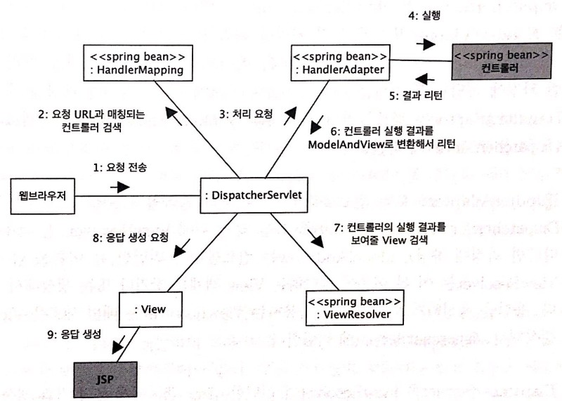

### 스프링 MVC의 핵심 구성 요소 간단 요약


1. DispatcherServlet은 모든 연결을 담당한다. 
 
2. DispatcherServlet은 요청이 들어오면 요청을 처리하기 위한 컨트롤러를 찾기 위해 HandlerMapping 빈에게 검색을 요청한다. HandlerMapping빈은 요청을 처리할 컨트롤러 빈 객체를 DispatcherServlet에 전달한다.

3. DispatcherServlet은 HandlerAdapter 빈에게 컨트롤러 요청 처리를 위임한다.

4-6. HandlerAdapter빈은 컨트롤러를 통해 요청을 처리하고 ModelAndView라는 객체로 변환해서 DispatcherServlet에게 리턴한다.

7. DispatcherServlet은 ModelAndView 객체안의 view 이름을 통해 ViewResolver 빈 객체에게 해당하는 View 객체를 요청한다. ViewResolVer는 DispatcherServlet에게 View 객체를 찾거나 생성해서 리턴한다.

8.  DIspatcherServlet은 View 객체에 응답 결과 생성을 요청한다.

9. View 객체가 JSP를 실행한다.

DispatcherServlet 코드를 확인하여 이와 같이 동작하는 지 알아본다.

### DispatcherServlet의 doDispatch 메서드 - 실습으로 확인하기

```java
protected void doDispatch(HttpServletRequest request, HttpServletResponse response) throws Exception {
   HttpServletRequest processedRequest = request;
   HandlerExecutionChain mappedHandler = null;
   boolean multipartRequestParsed = false;

   WebAsyncManager asyncManager = WebAsyncUtils.getAsyncManager(request);

   try {
      ModelAndView mv = null;
      Exception dispatchException = null;

      try {
         processedRequest = checkMultipart(request);
         multipartRequestParsed = (processedRequest != request);

         // Determine handler for the current request.
         mappedHandler = getHandler(processedRequest);
         if (mappedHandler == null) {
            noHandlerFound(processedRequest, response);
            return;
         }

         // Determine handler adapter for the current request.
         HandlerAdapter ha = getHandlerAdapter(mappedHandler.getHandler());

         // Process last-modified header, if supported by the handler.
         String method = request.getMethod();
         boolean isGet = HttpMethod.GET.matches(method);
         if (isGet || HttpMethod.HEAD.matches(method)) {
            long lastModified = ha.getLastModified(request, mappedHandler.getHandler());
            if (new ServletWebRequest(request, response).checkNotModified(lastModified) && isGet) {
               return;
            }
         }

         if (!mappedHandler.applyPreHandle(processedRequest, response)) {
            return;
         }

         // Actually invoke the handler.
         mv = ha.handle(processedRequest, response, mappedHandler.getHandler());

         if (asyncManager.isConcurrentHandlingStarted()) {
            return;
         }

         applyDefaultViewName(processedRequest, mv);
         mappedHandler.applyPostHandle(processedRequest, response, mv);
      }
      catch (Exception ex) {
         dispatchException = ex;
      }
      catch (Throwable err) {
         // As of 4.3, we're processing Errors thrown from handler methods as well,
         // making them available for @ExceptionHandler methods and other scenarios.
         dispatchException = new NestedServletException("Handler dispatch failed", err);
      }
      processDispatchResult(processedRequest, response, mappedHandler, mv, dispatchException);
   }
   catch (Exception ex) {
      triggerAfterCompletion(processedRequest, response, mappedHandler, ex);
   }
   catch (Throwable err) {
      triggerAfterCompletion(processedRequest, response, mappedHandler,
            new NestedServletException("Handler processing failed", err));
   }
   finally {
      if (asyncManager.isConcurrentHandlingStarted()) {
         // Instead of postHandle and afterCompletion
         if (mappedHandler != null) {
            mappedHandler.applyAfterConcurrentHandlingStarted(processedRequest, response);
         }
      }
      else {
         // Clean up any resources used by a multipart request.
         if (multipartRequestParsed) {
            cleanupMultipart(processedRequest);
         }
      }
   }
}
```

코드를 간단하게 하나씩 확인해보자.

### 1.  handler를 조회한다.

```java
// Determine handler for the current request.
mappedHandler = getHandler(processedRequest);
if (mappedHandler == null) {
   noHandlerFound(processedRequest, response);
   return;
}
```

handler를 찾지못하면 예외가 발생한다. (not found)

getHandler의 내부는 다음과 같다.

```java
@Nullable
protected HandlerExecutionChain getHandler(HttpServletRequest request) throws Exception {
   if (this.handlerMappings != null) {
      for (HandlerMapping mapping : this.handlerMappings) {
         HandlerExecutionChain handler = mapping.getHandler(request);
         if (handler != null) {
            return handler;
         }
      }
   }
   return null;
}
```

handlerMapping을 통해 handler를 찾아온다.

### 2. handler adapter를 조회한다.

```java
// Determine handler adapter for the current request.
HandlerAdapter ha = getHandlerAdapter(mappedHandler.getHandler());
```

### 3. interceptor를 실행한다.

```java
if (!mappedHandler.applyPreHandle(processedRequest, response)) {
   return;
}
```

applyPreHandle 메서드를 확인해보자.

```java
boolean applyPreHandle(HttpServletRequest request, HttpServletResponse response) throws Exception {
   for (int i = 0; i < this.interceptorList.size(); i++) {
      HandlerInterceptor interceptor = this.interceptorList.get(i);
      if (!interceptor.preHandle(request, response, this.handler)) {
         triggerAfterCompletion(request, response, null);
         return false;
      }
      this.interceptorIndex = i;
   }
   return true;
}
```

이 메서드에서 **interceptor의 preHandle 메서드**를 실행한다.

어제 후디와 페어를 진행하면서 preHandle의 반환형이 왜 boolean 인 것 인지,

preHandle이 false를 반환하면 시스템이 종료되는 이유는 무엇 인지 얘기가 나왔었다.

그 이유를 이 코드에서 확인 할 수 있어서 좋았다.

**interceptor의 preHandle 메서드**가 false를 반환하면 applyPreHandle 메서드가 false를 반환한다.

그렇게 되면 아래의 코드에서 return을 하게 된다.

```java
if (!mappedHandler.applyPreHandle(processedRequest, response)) {
   return;
}
```

따라서 interceptor의 반환형이 boolean이고 default 값으로 true를 가지고 있는 이유에 대해서 알게 되었다.

### 4. 핸들러 어댑터를 통해 핸들러를 실행하여 ModelAndView를 반환한다.

```java
// Actually invoke the handler.
mv = ha.handle(processedRequest, response, mappedHandler.getHandler());
```

### 5. interceptor의 postHandle을 실행한다.

```java
mappedHandler.applyPostHandle(processedRequest, response, mv);
```

### 6. ModelAndView를 처리할 핸들러 선택 및 핸들러 호출 결과를 처리한다.

```java
processDispatchResult(processedRequest, response, mappedHandler, mv, dispatchException);
```

```
private void processDispatchResult(HttpServletRequest request, HttpServletResponse response,
      @Nullable HandlerExecutionChain mappedHandler, @Nullable ModelAndView mv,
      @Nullable Exception exception) throws Exception {
      
      ...
      
      render(mv, request, response);
      
      }
```

```java
protected void render(ModelAndView mv, HttpServletRequest request,
  HttpServletResponse response) throws Exception {
  
  ...
  
  	View view;
  
  ...
  
	String viewName = mv.getViewName(); 
    
  ...
  
    view = resolveViewName(viewName, mv.getModelInternal(), locale, request);
  
  ...
  
    view.render(mv.getModelInternal(), request, response);
  }
```

### 뷰 리졸버에서 View 객체를 리턴한다.

```java
protected View resolveViewName(String viewName, @Nullable Map<String, Object> model,
      Locale locale, HttpServletRequest request) throws Exception {

   if (this.viewResolvers != null) {
      for (ViewResolver viewResolver : this.viewResolvers) {
         View view = viewResolver.resolveViewName(viewName, locale);
         if (view != null) {
            return view;
         }
      }
   }
   return null;
}
```