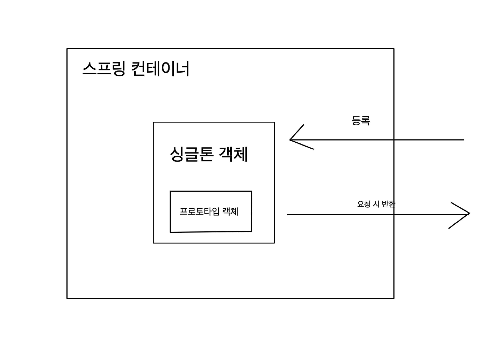

### 스프링5 책 내용 간단 정리

스프링 컨테이너는 초기화와 종료라는 라이프 사이클을 가진다. 그리고 빈 객체의 라이프 사이클을 관리한다.

스프링 컨테이너의 라이프 사이클:

`빈 객체 생성` -> `의존 설정` -> `빈 객체 초기화 (지정된 메서드 호출)` -> `컨테이너 종료 시 빈 객체 소멸 처리 (지정된 메서드 호출)`

빈 객체의 라이프 사이클 : `객체 생성` -> `의존 설정` -> `초기화` -> `소멸`

### 빈 객체의 관리 범위

#### 1. 싱글톤 (default) : 스프링 컨테이너의 시작과 종료까지 유지되는 가장 넓은 범위의 스코프

싱글 스코프의 빈을 조회하면 스프링 컨테이너에서 항상 같은 인스턴스의 스프링 빈을 반환한다.

#### 2. 프로토 타입 : 빈 객체를 구할 때 마다 새로운 객체 생성한다.

싱글톤일 때

```java
@Configuration
public class WootecoContext {

    @Bean
    public Student student1() {
        Student student = new Student();
        student.setName("잉");
        return student;
    }
}
```

main에서 실행

```java
public class Main {
    public static void main(String[] args) {
        ApplicationContext ac = new AnnotationConfigApplicationContext(WootecoContext.class);

        final Student student1 = ac.getBean("student1",Student.class);
        final Student student2 = ac.getBean("student1", Student.class);

        System.out.println(student1 == student2);			// true
        System.out.println("student1 : " + student1.getName());		// 잉
        System.out.println("student2 : " + student2.getName());		// 잉
    }
}
```

prototype으로 스코프 변경

```java
@Bean
@Scope("prototype")
public Student student2() {
    Student student = new Student();
    student.setName("썬");
    return student;
}
```

결과

```java
public class Main {
    public static void main(String[] args) {
        ApplicationContext ac = new AnnotationConfigApplicationContext(WootecoContext.class);

        final Student student1 = ac.getBean("student2",Student.class);
        final Student student2 = ac.getBean("student2", Student.class);

        System.out.println(student1 == student2);			//false
        System.out.println("student1 : " + student1.getName());		//썬
        System.out.println("student2 : " + student2.getName());		//썬
    }
}
```

스프링에서는 프로토타입 빈의 생성과 의존관계 주입까지만 관여한다. (관리 안해줌)

따라서 프로토타입 빈은 조회한 클라이언트가 직접 종료해야한다.

컴포넌트 등록 시에도 @Scope를 사용하여 스코프 설정 가능

```java
@Scope("prototype")
@Component
public class Student {
```

---

### 간단한 문제

```java
public class Student {

    private String name;

    public void setName(String name) {
        this.name = name;
    }

    public String getName() {
        return name;
    }
}
```

```java
public class Wooteco {

    private Student student;

    public Student getStudent() {
        return student;
    }

    public void setStudent(Student student) {
        this.student = student;
    }
}
```

```java
@Configuration
public class WootecoContext {

    @Scope("prototype")
    @Bean
    public Student student() {
        Student student = new Student();
        student.setName("잉");
        return student;
    }

    @Bean
    public Wooteco wooteco() {
        Wooteco wooteco = new Wooteco();
        wooteco.setStudent(student());
        return wooteco;
    }
}
```

```java
public class Main {
    public static void main(String[] args) {
        ApplicationContext ac = new AnnotationConfigApplicationContext(WootecoContext.class);

        final Wooteco wooteco1 = ac.getBean(Wooteco.class);
        final Wooteco wooteco2 = ac.getBean(Wooteco.class);

        System.out.println(wooteco1 == wooteco2);  // 1번
        System.out.println(wooteco1.getStudent() == wooteco2.getStudent()); // 2번
    }
}
```

1번 2번은 각각 어떤 결과가 나올까?

<br>
<br>
<br>
<br>
<br>
<br>
<br>
<br>
<br>
<br>
<br>
<br>
<br>
<br>

정답은 true, true

싱글톤 빈으로 등록된 Wooteco에서 가지고 있는 student는 이미 과거에 주입이 끝난 빈이다 !




이런 식으로 싱글톤 타입과 프로토타입을 함께 사용하면 원하지 않는 결과가 나타날 수 있다.

### 싱글톤 빈과 프로토타입을 함께 사용 시 문제 해결

간단한 방법으로 싱글톤 빈이 프로토타입을 사용할 때 마다 스프링 컨테이너에 새로 요청한다.

스프링의 ObjaectProvider를 이용하자

```java
@Configuration
public class WootecoContext {

    @Scope("prototype")
    @Bean
    public Student student() {
        Student student = new Student();
        student.setName("잉");
        return student;
    }

    @Bean
    public Wooteco wooteco() {
        return new Wooteco();
    }
}
```

```java
public class Wooteco {

    @Autowired
    private ObjectProvider<Student> objectProvider;

    public Student getStudent() {
        final Student student = objectProvider.getObject();
        return student;
    }
}
```

```java
public class Main {
    public static void main(String[] args) {
        ApplicationContext ac = new AnnotationConfigApplicationContext(WootecoContext.class);

        final Wooteco wooteco = ac.getBean(Wooteco.class);

        final Student student1 = wooteco.getStudent();
        final Student student2 = wooteco.getStudent();
        System.out.println(student1 == student2);   // false
    }
}
```

위와 같이 의존관계를 외부에서 주입(DI) 받는게 아니라 직접 필요한 의존 관계를 찾는 것을 의존관계 조회(Dependency Lookup (DL))이라 한다. ObjectProvider 는 DL 기능을 제공한다.

### 그렇다면 프로토타입 빈은 왜 사용하는 것일까?

싱글톤의 경우 객체를 1개만 생성한다는 장점이 있으나, Web 같이 여러 명이 같은 객체를 사용하는 과정에서 문제가 발생할 수 있다.

상태를 가지는 객체의 경우, 여러 사람이 사용할 때 문제가 발생할 수 있다.

만약 상태를 가지는 객체를 빈으로 등록하고 싶으면 Scope를 Prototype으로 바꿔서 사용해야한다.

그러면 요청할 때 마다 Bean 객체가 생성되어 충돌이 발생하지 않는다.

그런데 직접 사용할 일은 드물다고 함.
