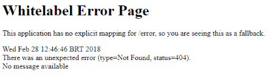
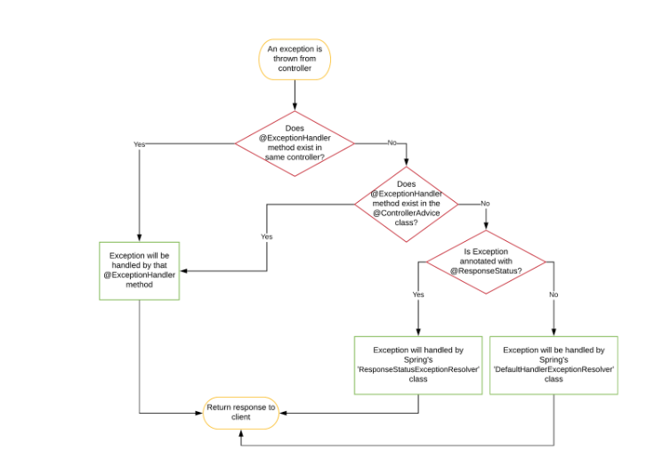

# Exception Handler

## Spring에서의 예외 처리



### 예외 Controller를 활용한 처리

Spring(1.0)이 만들어질 때부터 예러 처리를 위한 BasicErrorController가 구현되어 있었다.  
웹 브라우저에서 예외를 발생할 경우 `errorHtml()`을 거쳐 ViewResolver를 통해 에러 페이지를 반환하며,  
브라우저가 아닌 곳(Postman, Curl, 서버 등)에서 요청할 경우 `error()`를  거쳐 에러 메시지를 받게 된다.  
에러 경로는 기본적으로 /error로 정의되어 있으며 properties에서 server.error.path로 변경할 수 있다.  

```java
@Controller
@RequestMapping("${server.error.path:${error.path:/error}}")
public class BasicErrorController extends AbstractErrorController {

    private final ErrorProperties errorProperties;
    ...
 
    @RequestMapping(produces = MediaType.TEXT_HTML_VALUE)
    public ModelAndView errorHtml(HttpServletRequest request, HttpServletResponse response) {
        HttpStatus status = getStatus(request);
        Map<String, Object> model = Collections
                .unmodifiableMap(getErrorAttributes(request, getErrorAttributeOptions(request, MediaType.TEXT_HTML)));
        response.setStatus(status.value());
        ModelAndView modelAndView = resolveErrorView(request, response, status, model);
        return (modelAndView != null) ? modelAndView : new ModelAndView("error", model);
    }

    @RequestMapping
    public ResponseEntity<Map<String, Object>> error(HttpServletRequest request) {
        HttpStatus status = getStatus(request);
        if (status == HttpStatus.NO_CONTENT) {
            return new ResponseEntity<>(status);
        }
        Map<String, Object> body = getErrorAttributes(request, getErrorAttributeOptions(request, MediaType.ALL));
        return new ResponseEntity<>(body, status);
    }
    ...
}
```

이때, `errorHtml()`과 `error()`은 모두 `getErrorAttributeOptions()`를 호출해 반환할 에러 속성을 받아오는데,  
<U>DefaultErrorAttributes</U> 로부터 반환할 정보를 반환한다.

DefaultErrorAttributes는 기본적으로 아래를 포함하고 있다.
- timestamp - The time that the errors were extracted
- status - The status code
- error - The error reason
- exception - The class name of the root exception (if configured)
- message - The exception message (if configured)
- errors - Any ObjectErrors from a BindingResult exception (if configured)
- trace - The exception stack trace (if configured)
- path - The URL path when the exception was raised

기본적인 에러 응답
```java
{
    "timestamp": "2022-06-07T01:46:12.675+00:00",
    "status": 500,
    "error": "Internal Server Error",
    "path": "/item/1"
}
```

이러한 응답은 클라이언트에게 유용하지 못하므로 조금 더 많은 정보를 담기 위해서는 별도의 설정이 필요하다.  
DefaultErrorAttributes의 코드를 살펴보면 isIncluded를 통해 옵션이 활성화되어 있는지 살펴본다.  

DefaultErrorAttributes.java
```java
@Order(Ordered.HIGHEST_PRECEDENCE)
public class DefaultErrorAttributes implements ErrorAttributes, HandlerExceptionResolver, Ordered { 
    ...

    @Override
    public Map<String, Object> getErrorAttributes(WebRequest webRequest, ErrorAttributeOptions options) {
        Map<String, Object> errorAttributes = getErrorAttributes(webRequest, options.isIncluded(Include.STACK_TRACE));
        if (!options.isIncluded(Include.EXCEPTION)) {
            errorAttributes.remove("exception");
        }
        if (!options.isIncluded(Include.STACK_TRACE)) {
            errorAttributes.remove("trace");
        }
        if (!options.isIncluded(Include.MESSAGE) && errorAttributes.get("message") != null) {
            errorAttributes.remove("message");
        }
        if (!options.isIncluded(Include.BINDING_ERRORS)) {
            errorAttributes.remove("errors");
        }
        return errorAttributes;
    }
    ...
}
```

설정 변경은 properties로 가능하며, 아래와 같이 변경하면 된다.
```java
server.error.include-message: always
server.error.include-binding-errors: always
server.error.include-stacktrace: always
server.error.include-exception: false
```

```java
{
    "timestamp": "2022-06-07T01:46:12.675+00:00",
    "status": 500,
    "error": "Internal Server Error",
    "trace": "java.util.NoSuchElementException: No value ...",
    "message": "No value present",
    "path": "/item/1"
}
```
> 참고: 다만, trace를 노출할 경우, client에게 너무 많은 정보를 넘겨주기 때문에 숨기는 것이 좋다.

다만, 지금의 경우에도 status는 여전히 500이므로 유의미한 응답이 아니다.  
하여 별도로 에러 처리 전략을 사용해야 한다.

## Spring의 예외처리 방법

### HandlerExceptionResolver 인터페이스
Spring에서 에러 처리는 공통 관심사이므로 예외 처리 전략을 추상화한 인터페이스를 만들어두었다.
```java
public interface HandlerExceptionResolver {
    @Nullable
    ModelAndView resolveException(
            HttpServletRequest request, HttpServletResponse response, @Nullable Object handler, Exception ex);
}
```

위 handler는 예외가 발생한 컨트롤러 객체이며, 컨트롤러에서 예외가 던져지면 DispatcherServlet까지 전달되며,  
DispatcherServlet은 상황에 맞는 예외 처리 전략을 위해 HandlerExceptionResolver의 구현체들을 빈으로 등록해 관리한다.  

4가지 구현체
- DefaultErrorAttributes: 속성 관리용이며 예외 처리용이 아님
1. DefaultHandlerExceptionResolver: 스프링의 예외들을 처리
2. ResponseStatusExceptionResolver: @ResponseStatus 또는 ResponseStatusException에 의한 예외를 처리
3. ExceptionHandlerExceptionResolver: Controller나 ControllerAdvice에 있는 ExceptionHandler에 의한 예외 처리

여기서 알아볼 것은 1번과 2번.  

### @ResponseStatus
HTTP 상태 코드를 변경하도록 도와주는 어노테이션  

ex)
```java
@ResponseStatus(value = HttpStatus.BAD_REQUEST)
public class NotFoundException extends RuntimeException {
    ...
}
```

이렇게 되면 ResponseStatusExceptionResolver를 통해 지정된 에러 응답이 내려간다.
```java
{
    "timestamp": "2022-06-07T01:46:12.675+00:00",
    "status": 404,
    "error": "Not Found",
    "path": "/item/1"
}
```

#### ResponseStatus의 한계
- 에러 응답의 내용이 수정 불가능
- 예외 상황마다 예외 클래스를 추가해야 함
- 예외 클래스와 강하게 결합되어 모든 예외에 대해 동일한 상태+메시지가 반환됨

### @ExceptionHandler
가장 유연한 에러 처리 방법.  
- 컨트롤러 메서드
- `@ControllerAdvice`나 `@RestControllerAdvice` 클래스의 메서드

```java
@RestController
public class CustomerController {

    ...

    @ExceptionHandler(ExpectedException.class)
    public ResponseEntity<ErrorResponse> handleExceptedException(final ExpectedException e) {
        return ResponseEntity.badRequest().body(new ErrorResponse(e.getMessage()));
    }

    @ExceptionHandler(ClientRuntimeException.class)
    public ResponseEntity<ErrorResponse> handleInvalidAccess(final ClientRuntimeException e) {
        return ResponseEntity.badRequest().body(new ErrorResponse(e.getMessage()));
    }
    ...
}
```

Exception 클래스들을 속성으로 받아 처리할 예외를 지정할 수 있으며, `@ResponseStatus`와도 결합이 가능하다.  
이때, ResponseEntity, `@ResponseStatus` 둘 다에서 status를 지정한다면 ResponseEntity가 우선순위를 가진다.  

`@ExceptionHandler`를 사용하면 에러 응답(payload)을 자유롭게 다룰 수 있다는 장점이 있다.  

#### 예외 발생시 적용 순서
1. 예외 발생시 가장 먼저 구체적인 예외 핸들러를 찾는다.
2. 해당 예외를 처리하지 않는다면, 부모 예외의 핸들러를 찾는다.

> 주의: @ExceptionHandler에 등록된 예외 클래스와 파라미터로 받는 예와 클래스가 동일해야 한다. 
> 만약 값이 다르다면 스프링은 컴파일 시점에는 문제 없지만, 런타임 시점에 에러가 발생한다.

#### ExceptionHandler 단점
자유롭게 예외를 처리할 수 있으나 컨트롤러에 구현해야 하므로 특정 컨트롤러에서만 예외를 처리할 때 용이하다.  
만약 여러 컨트롤러에서 똑같이 예외를 발생한다면? 코드 중복의 염려가 있으므로 @ExceptionHandler를 구현한  
공통 예외 처리 컨트롤러를 만들어야 한다. 다만 컨트롤러에 상속이 존재하는 또 다른 단점이 생긴다.

### @ControllerAdvice와 @RestControllerAdvice
ExceptionHandler의 한계를 극복한 전역적 예외 처리 방법.  

#### ControllerAdvice와 RestControllerAdvice의 차이
RestControllerAdvice는 ControllerAdvice와 달리 @ResponseBody가 붙어 있어 응답을 Json으로 내려준다.  
```java
@Target(ElementType.TYPE)
@Retention(RetentionPolicy.RUNTIME)
@Documented
@ControllerAdvice
@ResponseBody
public @interface RestControllerAdvice {
    ...
}

@Target(ElementType.TYPE)
@Retention(RetentionPolicy.RUNTIME)
@Documented
@Component
public @interface ControllerAdvice {
    ...
}
```

ControllerAdvice.java
```java
@RestControllerAdvice
public class ControllerAdvice {
    @ExceptionHandler(ExpectedException.class)
    public ResponseEntity<ErrorResponse> handleExceptedException(final ExpectedException e) {
        return ResponseEntity.badRequest().body(new ErrorResponse(e.getMessage()));
    }

    @ExceptionHandler(ClientRuntimeException.class)
    public ResponseEntity<ErrorResponse> handleInvalidAccess(final ClientRuntimeException e) {
        return ResponseEntity.badRequest().body(new ErrorResponse(e.getMessage()));
    }
    ...
}
```

ControllerAdvice는 모든 컨트롤러에서 동일하게 동작한다. 특정 클래스에만 사용하고 싶을 경우, basePackages를  
설정하여 제한 가능하다. 또한 스프링은 예외를 미리 처리해둔 ResponseEntityExceptionHandler를 추상 클래스로  
제공하고 있으며 모든 스프링 예외에 대해 구현하고 있어 ControllerAdvice가 이를 상속받게 하면 된다.

장점:
- 하나의 클래스로 모든 컨트롤러에서 전역적으로 예외 처리 가능
- 직접 정의한 에러 응답을 일관성있게 클라이언트에게 전달 가능
- try-catch문이 별도로 필요하지 않아 코드 가독성이 높아짐

주의점:
- 한 프로젝트당 하나의 ControllerAdvice를 사용할 것 
  - (@Order 어노테이션으로 순서를 지정하지 않으면, 스프링이 임의로 순서를 지정하므로 일관된 응답이 불가능)
- 여러 개가 필요하다면 basePackages나 annotations를 지정해야 함
- 직접 구현한 예외는 한 공간에서 관리

우선순위:
1. 같은 컨트롤러에 위치한 ExceptionHandler 중 처리 가능한 메서드
2. ControllerAdvice

### 스프링 예외처리 흐름

