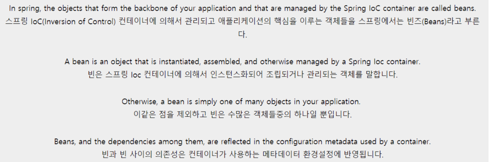
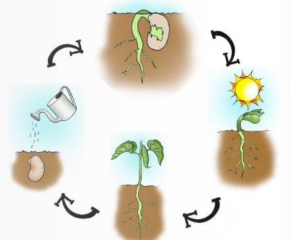
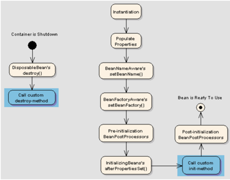

# Bean

## 그래서 Bean이 뭔데?
Spring IoC 컨테이너가 관리하는 자바 객체가 빈(Bean)이다.  
new 연산자로 어떠한 객체를 생성했을 때의 객체는 빈이 아니며 `ApplicationContext.getBean()`을 통해 얻어지는 객체가 빈이다.  
> 즉, Spring에서의 빈은 ApplicationContext가 알고 있는 객체이자 ApplicationContext가 만들어서 그 안에 담고 있는 객체를 의미한다.

### TMI
스프링은 가볍고 유연한 프레임워크이다.  

자바 빈(Java Beans)들은 많은 객체를 하나의 객체(Bean)으로 캡슐화하는 클래스다. `빈`이라는 이름은 자바에서 재사용 가능한 소프트웨어 구성 요소를 만드는 것을 목표로 만들어졌다.  

스프링 빈이란?  
스프링 빈은 스프링 컨테이너에서 생성, 관리 및 파괴되는 객체이다. metadata(xml 또는 주석)을 통해 객체를 Spring 컨테이너에 주입할 수 있으며, 이를 IoC(Inversion of Control)이라고 한다.  

농부들이 콩(또는 Bean)에 의해 경작되는 농지를 가지고 있다고 가정해보자.  
여기서, 농부는 Spring Framework이고, 농지는 Spring Container, 콩(Bean)은 Spring Beans이며 농작은 Spring Processor이다.  

실제 콩의 생명 주기(Life Cycle)  
  

스프링 빈의 Life Cycle  
  

### 기본적인 스프링 컨테이너의 생명주기
1. ApplicationContext를 이용해서 객체를 생성하고 스프링 컨테이너를 초기화한다.
2. getBean()과 같은 메서드를 이용해서 컨테이너에 있는 빈 객체를 사용한다.
3. close() 메서드를 이용해서 컨테이너를 종료한다.

스프링 컨테이너 초기화 / 종료 시 수행되는 작업
- 컨테이너 초기화: 빈 객체 생성, 초기화 및 의존 객체 주입
- 컨테이너 종료: 빈 객체 소멸

### 빈 객체의 생명주기

1. 스프링 컨테이너를 초기화 할 때, 가장 먼저 빈 객체를 생성한다.
2. 빈 객체 생성 후, <property> 태그로 지정한 의존을 설정합니다. (의존 주입도 이 단계에서 수행된다)
3. 모든 의존 설정이 완료되면, 빈 객체를 초기화한다.
   (빈 객체를 초기화하기 위해 빈 객체의 지정한 메서드를 호출)
4. 스프링 컨테이너를 종료하면, 스프링 컨테이너는 빈 객체를 소멸시킨다.  
(빈 객체의 소멸을 처리하기 위해 빈 객체의 지정한 메서드를 호출)

## 그래서 무엇을 Bean으로 설정해야 할까?
(p.101 주입 대상 객체를 모두 빈 객체로 설정해야 하나?)  
사실 제일 궁금했던 부분.

1. 프로그램 별로 공통적으로 쓸 수 있어야 한다.
2. 상태가 없는 객체여야 한다.
3. 싱글톤이어야 한다. (Bean Scope 관련)

> 그럼 유틸성 객체는? 모든 객체에 대해서 빈 등록을 해야할까?  
> 빈 등록은 필요할 때만 해야한다. 즉, 인스턴스화해 유지되어야 하는 클래스들만 빈으로 등록하면 된다. 예를 들어, 데이터베이스에 접근할 수 있는 클래스가 여러가지 있다고 가정하자.(jdbc, mock 등) 해당 클래스들은 다양한 구현을 가질 수 있으며 사용할 구현을 선택하는 것은 외부 구성에 따라 달라질 수 있다. 이때, 인스턴스의 관리 책임을 프레임워크에 위임할 수 있다.  

> 즉, 유틸성 클래스, 지하철에서는 Fare(요금)을 계산해주는 정적 클래스의 경우, 이를 관리해야할 일이 없다면, 빈 등록이 불필요하다.

### 그래서 4번!
4. 컨텍스트 실행 시점에 객체가 되어야 한다.
   (특정 시점에만 객체가 되었다가 사라져야 한다면 그냥 자바 객체)

## 참고
- https://dongmin1994.tistory.com/15
- https://stackoverflow.com/questions/17193365/what-in-the-world-are-spring-beans
