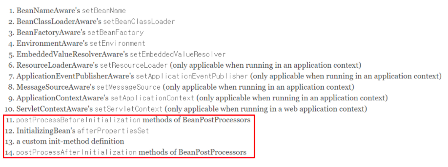
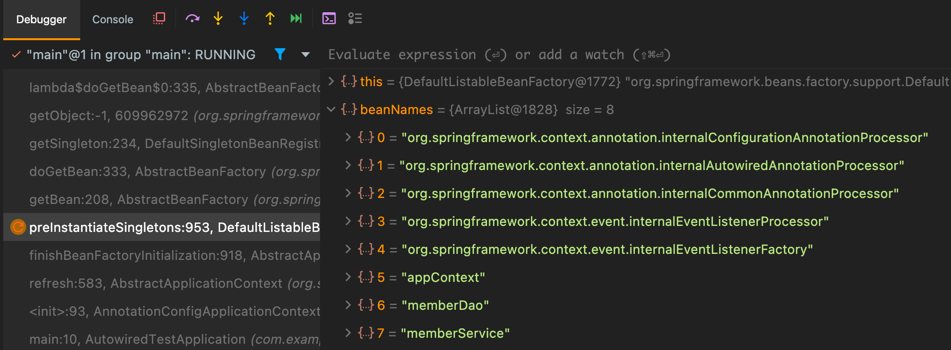
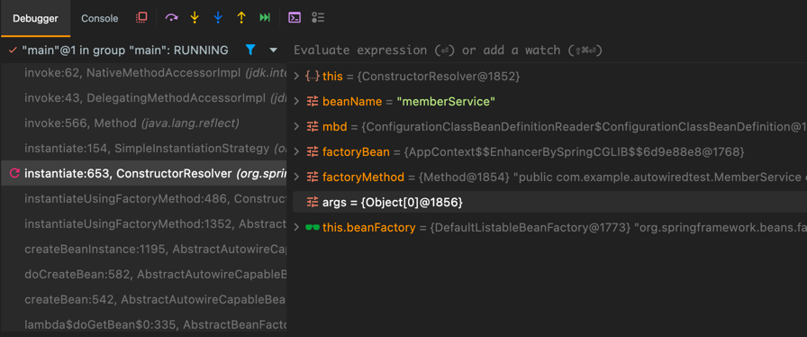

## Autowired 

- 스프링이 알아서 의존 객체를 찾아서 주입한다.

```java

public class MemberDao {

    void say(String what) {
        System.out.println("say " + what);
    }
}
```

```java

public class MemberService {

    private MemberDao memberDao;

    public MemberService() {
    }

    void hi() {
        memberDao.say("HI");
    }

    public void setMemberDao(MemberDao memberDao) {
        this.memberDao = memberDao;
    }
}

```

```java
@Configuration
public class AppContext {

    @Bean
    public MemberDao memberDao() {
        return new MemberDao();
    }

    @Bean
    public MemberService memberService() {
        MemberService memberService = new MemberService();
        memberService.setMemberDao(memberDao());
        return memberService;
    }
}

```

```java
public class AutowiredTestApplication {

    private static ApplicationContext ctx = null;
    public static void main(String[] args) {
        ctx = new AnnotationConfigApplicationContext(AppContext.class);
        MemberService memberService = ctx.getBean("memberService", MemberService.class);
        memberService.hi();
    }
}

// 출력
// say HI
```

```java
    @Autowired
    public void setMemberDao(MemberDao memberDao) {
        this.memberDao = memberDao;
    }
    
    @Bean
    public MemberService memberService() {
        MemberService memberService = new MemberService();
//        memberService.setMemberDao(memberDao());
        return memberService;
    }

// 출력
// say HI
```



초기화 단계의 이전에 동작하는 메서드 덕분에 빈을 찾을 수 있는 것

해당 메서드들은 어디있을까??

```java

public interface BeanPostProcessor {

	@Nullable
	default Object postProcessBeforeInitialization(Object bean, String beanName) throws BeansException {
		return bean;
	}

	@Nullable
	default Object postProcessAfterInitialization(Object bean, String beanName) throws BeansException {
		return bean;
	}
}

```






### 세 줄 요약
1. BeanFactory( ApplicationContext )가 BeanPostProcessor 타입의 Bean을 검색
2. IoC 컨테이너에 등록되어있는 다른 일반적인 Bean에게 BeanPostProcessor를 적용
3. 다른 Bean에 @Autowired Annotation을 처리하는 AutowiredAnnotationBeanPostProcessor의 로직이 적용
