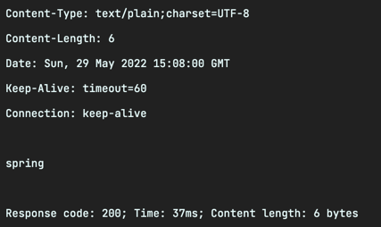
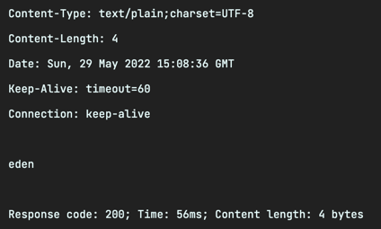
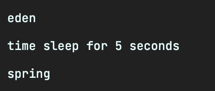
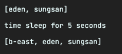

## Transaction Isolation(트랜잭션 격리 수준)

- DB에 여러 요청이 동시에 접근할 때 접근을 어떻게 제어할 것인지에 대한 설정

|값|설명|
|---|---|
|DEFAULT|DB 기본 설정|
|READ_UNCOMMITED|다른 트랜잭션이 커밋하지 않은 데이터 read|
|READ_COMMITED|다른 트랜잭션이 커밋한 데이터 read|
|REPEATABLE_READ|처음에 읽어온 데이터와 두 번째 읽어 온 데이터가 동일한 값|
|SERIALIZABLE|동일한 데이터에 대해 동시에 두 개 이상의 트랜잭션 수행 X|

### READ_UNCOMMITTED (커밋되지 않는 읽기, level 0)

트랜잭션 처리중 아직 commit 되지 않은 데이터를 다른 트랜잭션이 읽는 것을 허용

```java
@RestController
public class IsolationController {
    
    @GetMapping("/read-uncommitted1")
    public void readUncommitted() throws InterruptedException {
        isolationService.readUncommitted1();
    }

    @GetMapping("/read-uncommitted2")
    public String readUncommitted2() {
        return isolationService.readUncommitted2();
    }
}
```

```java
@Service
public class IsolationService {
    
    @Transactional(rollbackFor = RollBackException.class)
    public void readUncommitted1() throws InterruptedException {
        isolationDao.update1();
    }
    
    @Transactional(isolation = Isolation.READ_UNCOMMITTED)
    public String readUncommitted2() {
        return isolationDao.readUncommitted();
    }
}
```

```java
@Repository
public class IsolationDao {

    public void update1() throws InterruptedException {
        String sql = "update customer set username='spring' where id=1";
        jdbcTemplate.update(sql);
        Thread.sleep(5000);
        throw new RollBackException();
    }

    public String readUncommitted() {
        String sql = "select username from customer where id=1";
        return jdbcTemplate.queryForObject(sql, String.class);
    }
}
```


10초 뒤 다시



이것을 `Dirty read` 라고 함

### READ_COMMITTED (커밋된 읽기, level 1)

dirty read 방지 : 트랜잭션이 commit 되어 확정된 데이터만을 읽도록 허용

커밋이 완료된 트랜잭션의 변경 사항만 다른 트랜잭션에서 조회 가능

```java
@RestController
public class IsolationController {
    
    @GetMapping("/read-committed1")
    public void readCommitted() throws InterruptedException {
        isolationService.readCommitted1();
    }

    @GetMapping("/read-committed2")
    public String readCommitted2() throws InterruptedException {
        return isolationService.readCommitted2();
    }
}
```

```java
@Service
public class IsolationService {

    @Transactional
    public void readCommitted1() throws InterruptedException {
        isolationDao.update2();
    }

    @Transactional(isolation = Isolation.READ_COMMITTED)
    public String readCommitted2() throws InterruptedException {
        return isolationDao.readCommitted();
    }
}
```

```java
@Repository
public class IsolationDao {

    public void update2() throws InterruptedException {
        String sql = "update customer set username='spring' where id=1";
        jdbcTemplate.update(sql);
        Thread.sleep(5000);
    }

    public String readCommitted() throws InterruptedException {
        String sql = "select username from customer where id=1";
        String first = jdbcTemplate.queryForObject(sql, String.class);
        System.out.println(first);
        Thread.sleep(5000);
        String second = jdbcTemplate.queryForObject(sql, String.class);
        System.out.println(second);
        return second;
    }
}
```




이것을 `non-repeatable read` 라고 함

### REPEATABLE_READ (반복 가능한 읽기, level 2)

트랜잭션 범위 내에서 조회한 내용이 항상 동일함을 보장

트랜잭션이 완료될 때까지 SELECT 문장이 사용하는 모든 데이터에 shared lock이 걸린다.

```java
@Service
public class IsolationService {

    public void repeatableRead1() throws InterruptedException {
        isolationDao.update3();
    }

    @Transactional(isolation = Isolation.REPEATABLE_READ)
    public String repeatableRead2() throws InterruptedException {
        return isolationDao.repeatableRead();
    }
}
```

```java
@Repository
public class IsolationDao {
    
    public void update3() throws InterruptedException {
        Thread.sleep(5000);
        SimpleJdbcInsert simpleJdbcInsert = new SimpleJdbcInsert(jdbcTemplate)
                .withTableName("customer")
                .usingGeneratedKeyColumns("id");
        Map<String, String> params = new HashMap<>();
        params.put("username", "b-east");
        simpleJdbcInsert.executeAndReturnKey(params).longValue();
    }

    public String repeatableRead() throws InterruptedException {
        String sql = "select username from customer";
        RowMapper<String> rowMapper = (rs, rowNum) -> rs.getString("username");
        List<String> first = jdbcTemplate.query(sql, rowMapper);
        System.out.println(first);
        System.out.println("time sleep for 5 seconds");
        Thread.sleep(5000);
        List<String> second = jdbcTemplate.query(sql, rowMapper);
        System.out.println(second);
        return "hi";
    }
}
```



이를 `phantom read` 라고 함


### SERIALIZABLE (직렬화 가능, level 3)
완벽한 읽기 일관성 모드 제공(가장 엄격함)

성능 측면에서 동시 처리성능이 가장 낮다.

거의 사용되지 않는다.

트랜잭션이 완료될 때까지 SELECT 문장이 사용하는 모든 데이터에 shared lock이 걸리므로 다른 사용자는 그 영역에 해당하는 데이터에 대한 수정 및 입력이 불가능하다.

## 결론!

- 알아서 잘 사용하자!
