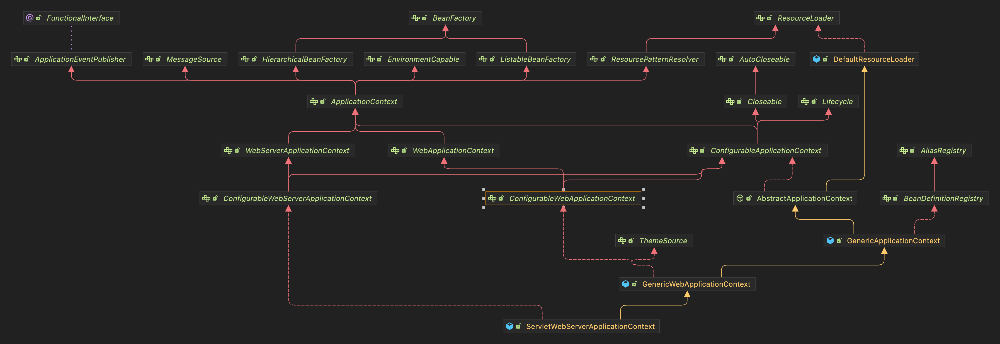
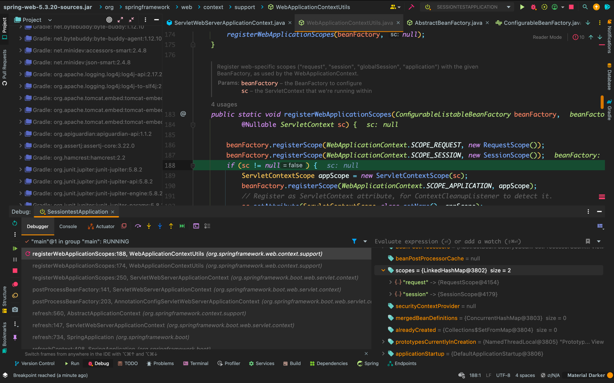
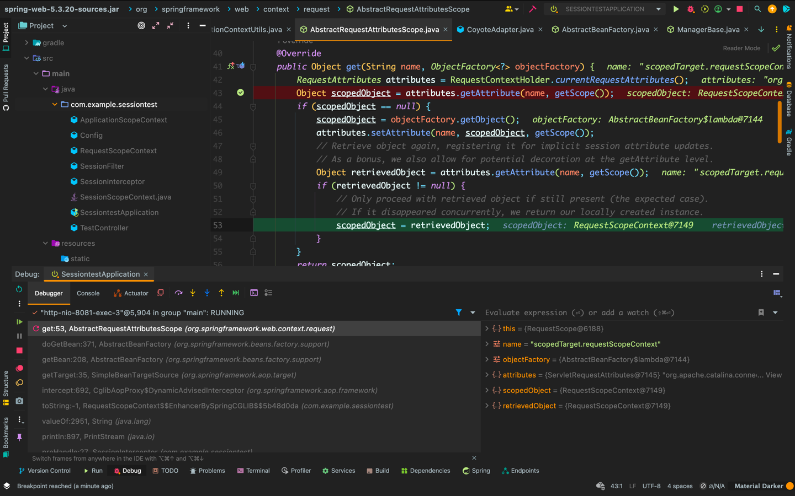
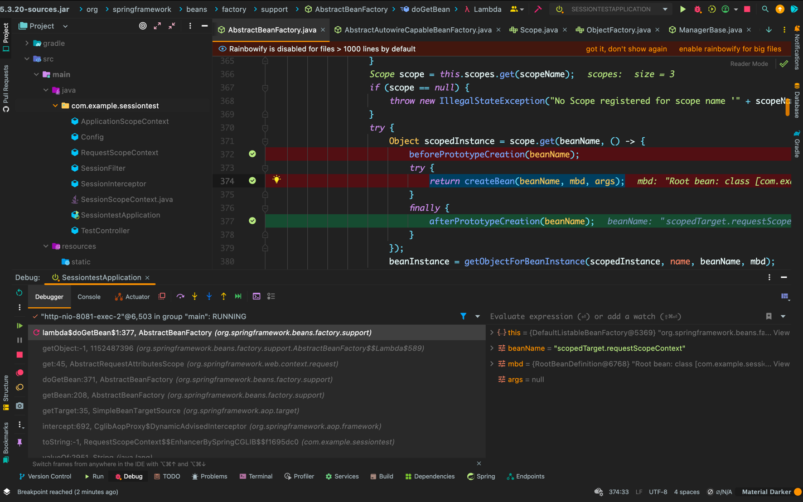
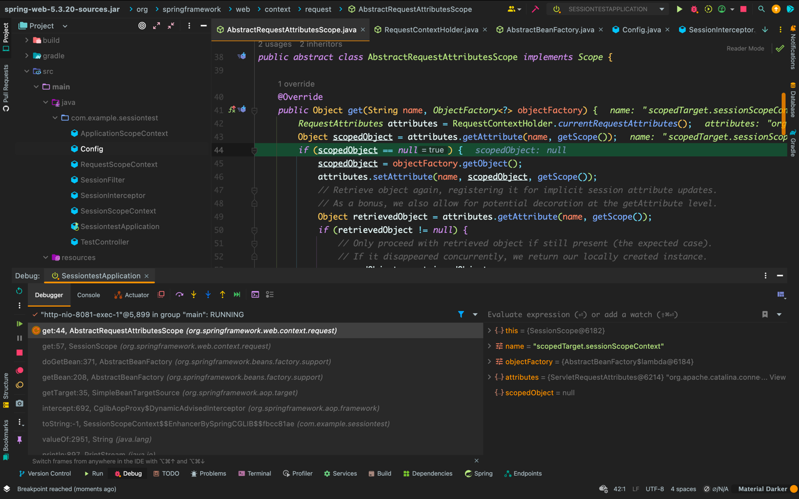
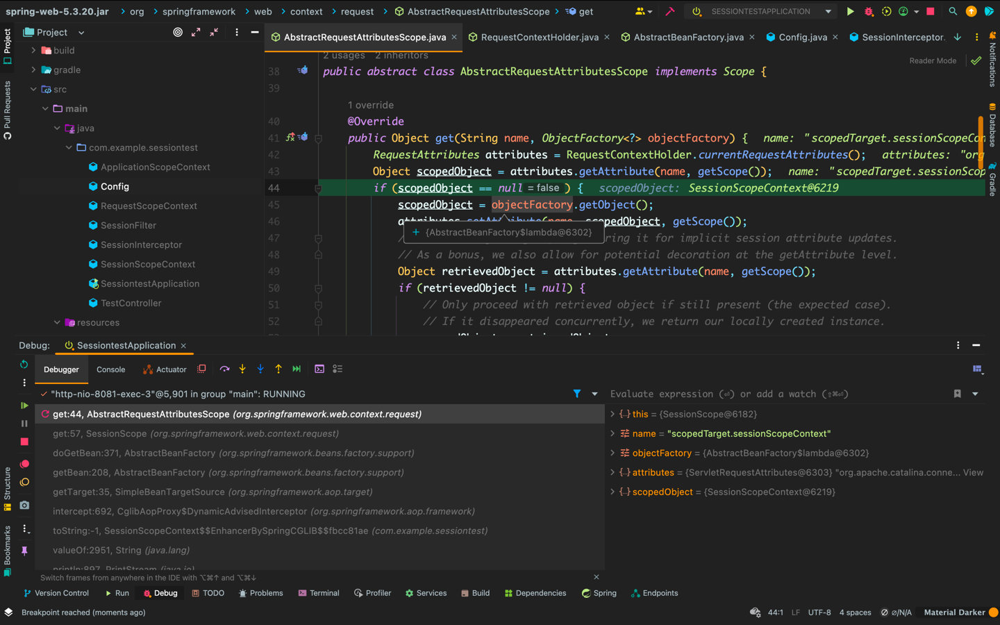
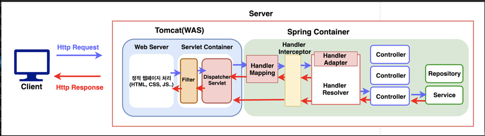
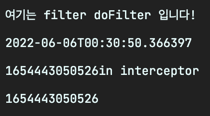
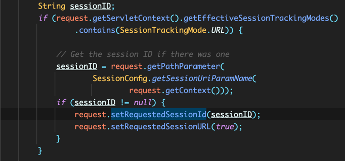

## Scope 종류

- springframework.beans.factory
  - singleton
  - prototype


- springframework.web.context
  - request
  - session
  - application

```java
public interface WebApplicationContext extends ApplicationContext {

	String SCOPE_REQUEST = "request";

	String SCOPE_SESSION = "session";

	String SCOPE_APPLICATION = "application";
}
```



```java
public class ServletWebServerApplicationContext extends GenericWebApplicationContext
        implements ConfigurableWebServerApplicationContext {
    
  @Override
  protected void postProcessBeanFactory(ConfigurableListableBeanFactory beanFactory) {
    beanFactory.addBeanPostProcessor(new WebApplicationContextServletContextAwareProcessor(this));
    beanFactory.ignoreDependencyInterface(ServletContextAware.class);
    registerWebApplicationScopes();
  }

  private void registerWebApplicationScopes() {
    ExistingWebApplicationScopes existingScopes = new ExistingWebApplicationScopes(getBeanFactory());
    WebApplicationContextUtils.registerWebApplicationScopes(getBeanFactory());
    existingScopes.restore();
  }
}
```
registerWebApplicationScopes() 에서 스코프 등록



### Request Scope

```java
public abstract class AbstractRequestAttributesScope implements Scope {

  @Override
  public Object get(String name, ObjectFactory<?> objectFactory) {
    RequestAttributes attributes = RequestContextHolder.currentRequestAttributes();
    Object scopedObject = attributes.getAttribute(name, getScope());
    if (scopedObject == null) {
      scopedObject = objectFactory.getObject();
      attributes.setAttribute(name, scopedObject, getScope());
      // Retrieve object again, registering it for implicit session attribute updates.
      // As a bonus, we also allow for potential decoration at the getAttribute level.
      Object retrievedObject = attributes.getAttribute(name, getScope());
      if (retrievedObject != null) {
        // Only proceed with retrieved object if still present (the expected case).
        // If it disappeared concurrently, we return our locally created instance.
        scopedObject = retrievedObject;
      }
    }
    return scopedObject;
  }
}
```





## Session Scope





### 테스트

```java

public class SessionInterceptor implements HandlerInterceptor {

  @Override
  public boolean preHandle(HttpServletRequest request, HttpServletResponse response, Object handler)
          throws Exception {
    System.out.println(applicationScopeContext);
    System.out.println(requestScopeContext);
    System.out.println(sessionScopeContext);
    return true;
  }
}
```
출력 
```bash
com.example.sessiontest.ApplicationScopeContext@3ddb9088
com.example.sessiontest.RequestScopeContext@2021a7a7
com.example.sessiontest.SessionScopeContext@5004d5d6

com.example.sessiontest.ApplicationScopeContext@3ddb9088
com.example.sessiontest.RequestScopeContext@4b3650bd
com.example.sessiontest.SessionScopeContext@5004d5d6
```

## Proxy Mode

```java
@Component
@Scope(value = SCOPE_REQUEST, proxyMode = ScopedProxyMode.TARGET_CLASS)
public class RequestScopeContext {

}

```

`Scope 'request' is not active for the current thread`

이유는 request scope 의 라이프 사이클은 http 요청이 들어온 시점부터 응답이 나가는 시점까지인데,

서버를 처음 띄울 때에는 요청이 없기때문에 알맞은 빈을 못찾음

따라서 프록시 모드를 사용해 서버를 띄울 때에 가짜 객체를 생성하고 이를 잠깐 빈으로 등록

그리고 실제 요청이 들어오면 실제 빈을 다시 등록

## session 객체

주의! 앞으로 나올 session 은 http session 객체

### HttpSession 이란?

- client request 에서 client 를 식별하고, 해당 client 정보를 저장

- 서블릿 컨테이너에서 server 와 client 간의 session 을 제어

- 서블릿 컨테이너는 server 에서 servlet 생명 주기 관리, request 에 따른 스레드 생성, 동적 웹페이지 생성 등 servlet 과 상호 작용하는 web server 의 일부

- JVM 내에서 실행되는 web application 의 일부

- http servlet request 를 호출하면 jSessionId, session 생성
- http servlet request 를 호출 안하면 jSessionId, session 생성 X

세션 생성 시간도 같음 -> default 30분

### 생성되는 곳은?

HttpSession 도 Servlet Container 가 생성한 인스턴스

Tomcat 의 Servlet Container 에서!





## CoyoteAdapter



## ManagerBase
- protected Map<String, Session> sessions = new ConcurrentHashMap<>();
- createSession(String id) {}
- generateSessionId() {}

## ApplicationHttpRequest

- HttpServletRequest 구현체
- session 이 들어있음
- getSession() 을 하면서 session = localSession; 이런 방식으로 정의

## HttpServletRequest

Http프로토콜의 request 정보를 서블릿에게 전달하기 위한 목적으로 사용
